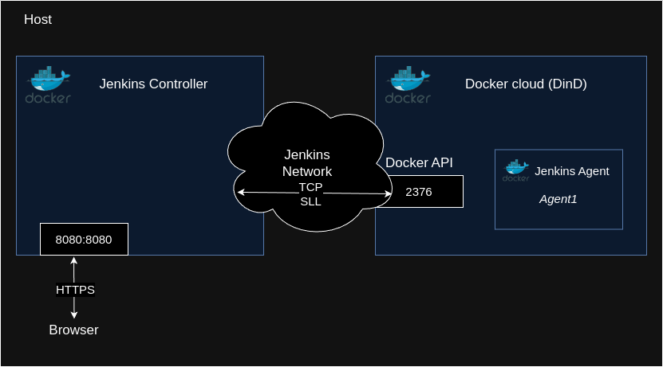

# jenkin-test

This a simple example of a Jenkins pipeline configuration that spins up agent nodes using a docker cloud. It runs two containers, one for the Jenkins controller and the other for a docker cloud (DinD container). 
The controller pulls for changes on the repos https://github.com/joaodiogo10/simple-web-project. The pipeline is source control managed in the repos. Changes on the main branch are detected, triggering the pipeline. The pipeline, in turn, builds and tests the node server.

The Jenkins controller runs on the local host on [localhost:8000](http:\\localhost:8080)

default user: joao

default pass: test

